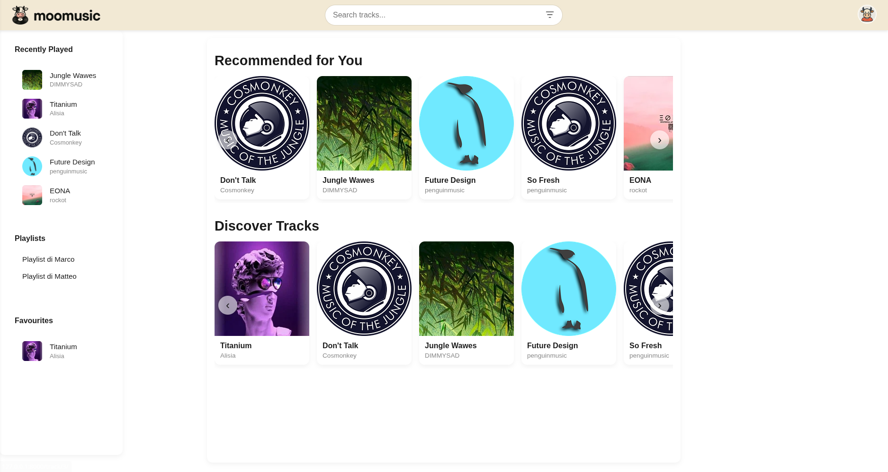
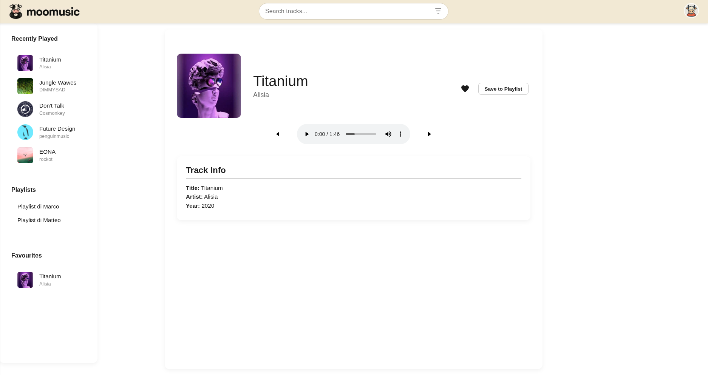
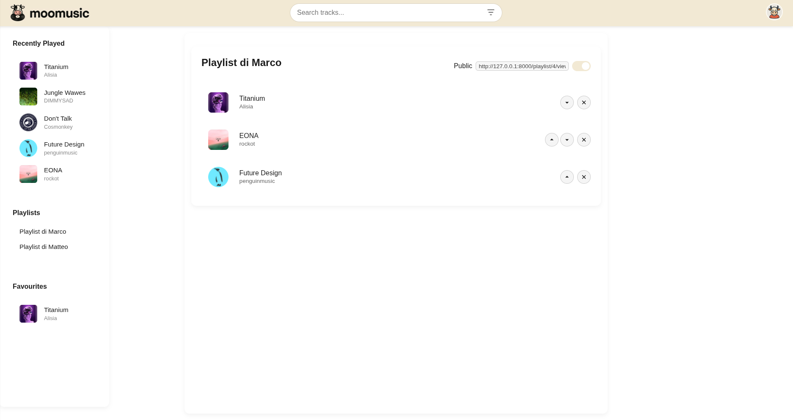
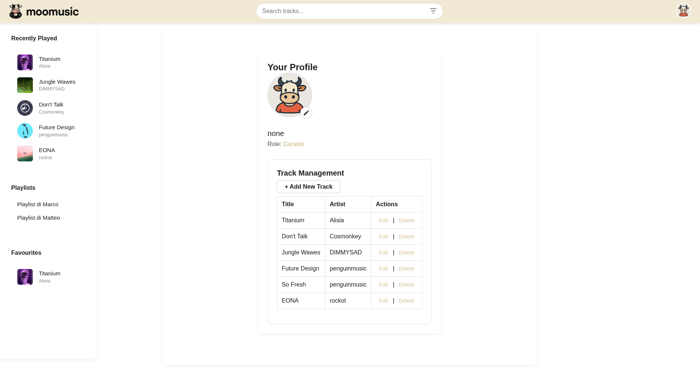

# MooMusic 🎵

MooMusic is a music player web app built with Django. It lets users upload, manage, and play audio tracks through a clean interface.

## Features

- Music streaming with models for songs, playlists, user profiles, and recommendations.  
- Views for browsing songs, creating playlists, user profiles, and personalized recommendations.  
- Search, filtering, and playlist sharing.  
- User registration and login forms.  
- Two user roles:  
  - **Listener:** Browse songs, manage own playlists, view recommendations.  
  - **Curator:** All Listener permissions plus add/edit/delete songs and genres.

## Screenshots

### 🎧 Home Page

### 🎶 Track Details

### 📁 Playlist View

### 👤 User Profile View  

## 🚀 Live Demo

App deployed at: [https://web-production-7fa0d.up.railway.app](https://web-production-7fa0d.up.railway.app)

There are two users:

- Marco (password: marco) is the Admin and a **Listener**
- Matteo (password: matteo) is a **Curator**
